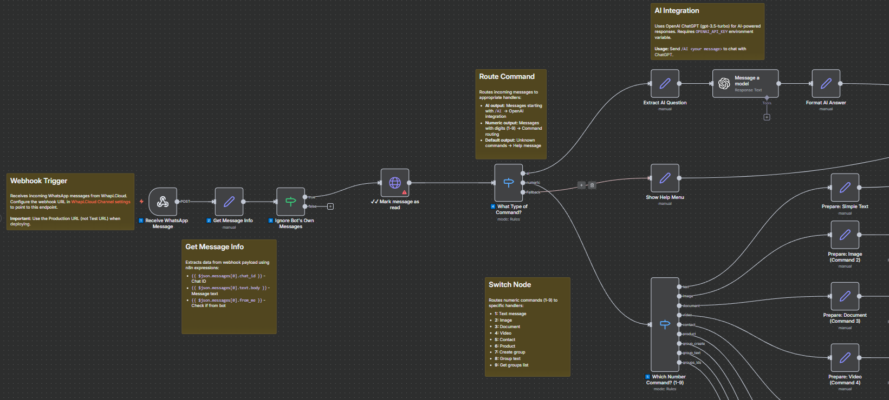

# 🤖 WhatsApp Bot Template for n8n | Whapi.Cloud Integration

[](https://n8n.io)
[](https://whapi.cloud)
[](LICENSE)

A **production-ready, no-code WhatsApp bot template** built with **n8n** and **Whapi.Cloud API**. Create intelligent WhatsApp chatbots without coding - perfect for businesses, developers, and automation enthusiasts. This template demonstrates **n8n WhatsApp automation**, **Whapi.Cloud integration**, and **no-code chatbot development**.



## ✨ Features

- **AI-Powered Chat** - OpenAI ChatGPT integration via `/ai` command
- **Multi-Media** - Send text, images, documents, videos, contacts
- **Group Management** - Create groups, send group messages, list groups
- **Product Catalog** - Send WhatsApp Business product information
- **Smart Routing** - Auto-detects AI commands, numeric commands (1-9), and help requests
- **Production Ready** - Built with best practices for reliability

> 💡 **Note:** Full WhatsApp automation without Meta limits: everything you need to send and receive WhatsApp messages, automate groups and build integrations using simple HTTP requests. The API supports messages, media, files, statuses, groups, communities and channels. You can receive incoming chats, send products, process orders, validate numbers and build custom automations.

## 🚀 Quick Start

### Prerequisites

- ✅ **n8n instance** (cloud or self-hosted) - [Get started](https://n8n.io)
- ✅ **Whapi.Cloud account** and API token - [Register](https://panel.whapi.cloud/register)
- ✅ (Optional) **OpenAI API key** for AI chat - [Get key](https://platform.openai.com/api-keys)

### Setup Steps

1. **Download** `whatsapp-demo-bot-whapi-n8n.json` from this repository

2. **Import to n8n:**
   - Open n8n → **Workflows** → **Add Workflow**
   - Click **three-dot menu** (⋮) → **Import from File...**
   - Select the downloaded JSON file

3. **Configure Whapi.Cloud:**
   - Click any Whapi node (e.g., "📤 Send Text Message")
   - **Authentication** → **Predefined Credential Type** → **Whapi API**
   - Enter your **Access Token** from [Whapi.Cloud Dashboard](https://panel.whapi.cloud)
   - *Alternative:* Use **Generic Credential Type** → **Header Auth** → `Authorization: Bearer YOUR_TOKEN`

4. **Setup Webhook:**
   - Click **"1️⃣ Receive WhatsApp Message"** webhook node
   - Click **Execute Node** → Copy the **Production URL**
   - In [Whapi.Cloud Dashboard](https://panel.whapi.cloud) → **Settings** → **Webhooks**
   - Add webhook: URL (your n8n webhook), Events: `messages`, Method: `POST`

5. **(Optional) Configure OpenAI:**
   - n8n → **Settings** → **Credentials** → Add **OpenAI API** credential

6. **Activate:** Toggle **Active** in the workflow editor


## 📱 Usage

Send commands to your WhatsApp number:

| Command | Action |
|---------|--------|
| `/ai <question>` | Chat with OpenAI ChatGPT |
| `1` | Send text message |
| `2` | Send image |
| `3` | Send document |
| `4` | Send video |
| `5` | Send contact (vCard) |
| `6` | Send product info |
| `7` | Create WhatsApp group |
| `8` | Send group message |
| `9` | Get groups list |
| Any other text | Show help menu |

**Example:**
```
You: /ai What is AI?
Bot: [AI response]

You: 2
Bot: [Sends image with caption]
```


## 🛠️ Customization

**You can customize the commands with your own keywords to adapt the bot for your business needs.**

- **Change commands:** Edit Switch nodes ("4️⃣ What Type of Command?", "5️⃣ Which Number Command?")
- **Modify messages:** Update Set nodes (e.g., "Show Help Menu", "Prepare: Simple Text")
- **Add features:** Extend with HTTP Request nodes, databases, Cron triggers, or conditional logic

The workflow is modular and well-documented with sticky notes explaining each section.

## 🐛 Troubleshooting

**Bot not responding?**
- ✅ Check workflow is **Active**
- ✅ Verify webhook URL in Whapi.Cloud dashboard
- ✅ Confirm Whapi token in credentials
- ✅ Check n8n execution logs

**Webhook issues?**
- ✅ Test webhook URL (should return 200 OK)
- ✅ Ensure n8n instance is publicly accessible

## 📚 Resources

- [n8n Docs](https://docs.n8n.io) - Workflow automation guide
- [Whapi.Cloud API](https://whapi.cloud/docs) - WhatsApp API reference
- [OpenAI API](https://platform.openai.com/docs) - AI integration guide
- [n8n Community](https://community.n8n.io) - Get help

## 📄 License

Educational and demonstration purposes. Review terms for [Whapi.Cloud](https://whapi.cloud/terms), [OpenAI](https://openai.com/policies/usage-policies), and [n8n](https://github.com/n8n-io/n8n/blob/master/LICENSE.md).

## 🤝 Contributing

Contributions welcome! Report bugs, suggest features, improve docs, or submit PRs. **If you have any inquiries or would like to share your experiences with us, please feel free to reach out: [care@whapi.cloud](care@whapi.cloud)**

⭐ **Star this repo** if it helped you build your WhatsApp bot!

---
